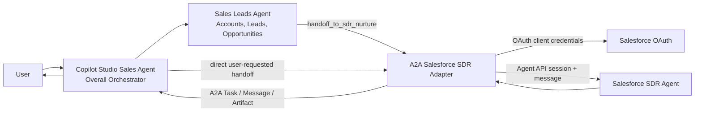
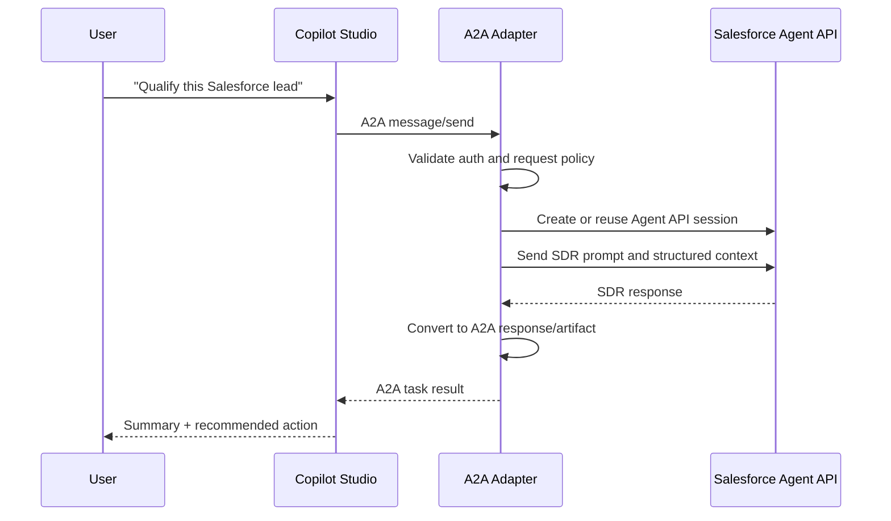
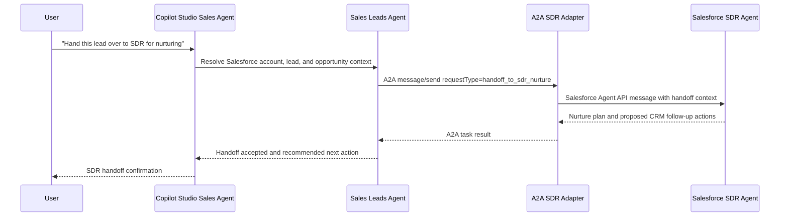

# A2A Design: Copilot Studio Agent to Salesforce SDR Agent

Date: 2026-06-01

## 1. Objective

Enable a Microsoft Copilot Studio sales agent to orchestrate sales workflows and hand over Salesforce leads to an SDR agent for nurturing through the Agent2Agent (A2A) protocol.

The target experience is:

1. A user works with the Copilot Studio Sales Agent as the overall orchestrator.
2. The Sales Leads Agent processes new or updated Salesforce accounts, leads, and opportunities.
3. When the user asks to hand over a lead for nurturing, the orchestrator or Sales Leads Agent delegates to the Salesforce SDR Agent through A2A.
4. The A2A endpoint invokes the Salesforce Agentforce SDR agent through Salesforce Agent API.
5. The SDR agent returns a nurture plan and proposed Salesforce follow-up actions in A2A format.

## 2. Key Design Decision

Salesforce Agentforce Agent API is not assumed to be directly A2A-compatible. The design uses an A2A adapter service in front of Salesforce:



This keeps Copilot Studio speaking A2A while letting Salesforce remain behind its native Agent API.

## 3. Current Platform Facts

Microsoft Copilot Studio supports connecting a custom agent to an external A2A agent. The external endpoint URL is the A2A communication endpoint, while metadata can be discovered from the endpoint's standard `/.well-known/agent.json` agent card.

Salesforce Agentforce Agent API exposes agents through REST APIs. It supports session creation, message exchange, streaming responses, session termination, and OAuth access tokens issued through an external client app.

A2A is built around agent discovery, message/task exchange, artifacts, and transport bindings such as JSON-RPC over HTTP, gRPC, and HTTP+JSON/REST. For this integration, use HTTP with A2A-compatible JSON payloads.

Sources:

- Microsoft Learn: https://learn.microsoft.com/en-us/microsoft-copilot-studio/add-agent-agent-to-agent
- Salesforce Agent API guide: https://developer.salesforce.com/docs/ai/agentforce/guide/agent-api.html
- Salesforce Agent API lifecycle: https://developer.salesforce.com/docs/ai/agentforce/guide/agent-api-lifecycle.html
- A2A specification: https://github.com/a2aproject/A2A/blob/main/docs/specification.md

## 4. Components

### 4.1 Copilot Studio Agent

Role: Primary user-facing orchestrator.

Responsibilities:

- Receive user requests.
- Decide whether a task belongs to the Salesforce SDR agent.
- Send the delegated task to the external A2A connection.
- Present the SDR agent response to the user.
- Apply enterprise policy, user consent, and human handoff where required.

Suggested delegation description in Copilot Studio:

> Use the Salesforce SDR Agent for sales-development tasks involving Salesforce leads, contacts, accounts, opportunities, outreach preparation, qualification research, next-best action recommendations, lead summaries, and CRM follow-up planning.

### 4.2 A2A Salesforce SDR Adapter

Role: Protocol bridge and trust boundary.

Responsibilities:

- Host the public A2A endpoint.
- Serve the A2A agent card at `/.well-known/agent.json`.
- Validate Copilot Studio authentication.
- Translate A2A messages into Salesforce Agent API calls.
- Manage Salesforce Agent API sessions.
- Convert Salesforce responses back into A2A messages/artifacts.
- Log task IDs, Salesforce session IDs, user/request metadata, and policy decisions.

Implementation options:

- Azure Container Apps
- Azure App Service
- Azure Functions with durable state
- Existing API gateway plus a small adapter service

### 4.3 Salesforce SDR Agent

Role: Domain specialist.

Responsibilities:

- Use Salesforce-native context, CRM records, flows, actions, and guardrails.
- Execute or recommend SDR workflows.
- Return structured summaries, recommendations, and follow-up actions.

Expected capabilities:

- Lead qualification
- Account/contact research from Salesforce context
- Outreach draft generation
- Next-best action recommendations
- CRM update recommendations or execution, depending on approval policy
- Objection-handling and discovery-call preparation

## 5. Endpoint Shape

### 5.1 Public Adapter URLs

Use stable HTTPS URLs:

```text
GET  https://sdr-a2a.contoso.com/.well-known/agent.json
POST https://sdr-a2a.contoso.com/a2a/salesforce-sdr/v1/message
POST https://sdr-a2a.contoso.com/a2a/salesforce-sdr/v1/message:stream
```

Copilot Studio should be configured with the communication endpoint, not the agent-card URL.

### 5.2 Agent Card Draft

```json
{
  "name": "Salesforce SDR Agent",
  "description": "Handles Salesforce sales-development tasks including lead qualification, account research, outreach preparation, CRM follow-up planning, and next-best action recommendations.",
  "url": "https://sdr-a2a.contoso.com/a2a/salesforce-sdr/v1/message",
  "version": "1.0.0",
  "capabilities": {
    "streaming": true,
    "pushNotifications": false
  },
  "defaultInputModes": ["text/plain", "application/json"],
  "defaultOutputModes": ["text/plain", "application/json"],
  "skills": [
    {
      "id": "lead-qualification",
      "name": "Lead Qualification",
      "description": "Qualifies Salesforce leads using CRM context and SDR criteria."
    },
    {
      "id": "outreach-prep",
      "name": "Outreach Preparation",
      "description": "Drafts personalized SDR outreach and call-prep notes."
    },
    {
      "id": "next-best-action",
      "name": "Next Best Action",
      "description": "Recommends the next CRM or engagement action for a prospect."
    }
  ],
  "securitySchemes": {
    "oauth2": {
      "type": "oauth2",
      "flows": {
        "clientCredentials": {
          "tokenUrl": "https://login.microsoftonline.com/{tenant}/oauth2/v2.0/token",
          "scopes": {
            "api://salesforce-sdr-a2a/.default": "Invoke Salesforce SDR A2A adapter"
          }
        }
      }
    }
  }
}
```

Adjust the exact schema fields to the A2A SDK/spec version used by the implementation.

## 6. Runtime Flow

### 6.1 Discovery

1. Copilot Studio admin creates an A2A connection.
2. Admin enters the adapter communication endpoint.
3. Copilot Studio attempts discovery at `https://sdr-a2a.contoso.com/.well-known/agent.json`.
4. Copilot Studio imports name and description.
5. Admin configures authentication.

### 6.2 Request/Response Task



### 6.3 Streaming Task

Use streaming when the SDR agent performs multi-step research or produces longer output. The adapter should stream incremental text back to Copilot Studio while retaining a durable task record.

### 6.4 Long-Running Task

For CRM research, enrichment, or approval workflows:

1. Adapter creates a durable A2A task.
2. Adapter starts Salesforce session/message processing.
3. Adapter returns an in-progress task state.
4. Copilot Studio polls or subscribes, depending on the supported A2A binding.
5. Adapter returns the final artifact when complete.

## 7. Context Contract

Copilot Studio should send the latest user request plus enough structured context for Salesforce routing.

Recommended adapter input contract:

```json
{
  "requestType": "lead_qualification",
  "userIntent": "Qualify the lead and recommend next action",
  "salesforce": {
    "leadId": "00Q...",
    "contactId": null,
    "accountId": null,
    "opportunityId": null
  },
  "conversation": {
    "locale": "en-US",
    "summary": "User is preparing an SDR follow-up.",
    "latestUserMessage": "Can you qualify this lead and draft outreach?"
  },
  "constraints": {
    "mayWriteToSalesforce": false,
    "requiresHumanApprovalForWrites": true,
    "allowedObjects": ["Lead", "Contact", "Account", "Opportunity", "Task"]
  }
}
```

The adapter should convert this into the Salesforce Agent API message format and preserve correlation IDs.

## 8. Output Contract

The Salesforce SDR agent should return structured output whenever possible:

```json
{
  "summary": "The lead appears qualified based on company size, role, and stated pain points.",
  "qualification": {
    "status": "qualified",
    "confidence": "medium",
    "reasons": [
      "Decision-maker title",
      "Relevant account segment",
      "Recent buying signal"
    ],
    "risks": [
      "No confirmed budget",
      "Timeline not yet established"
    ]
  },
  "recommendedNextAction": {
    "type": "send_email",
    "requiresApproval": true,
    "draft": "Hi {FirstName}, ..."
  },
  "salesforceUpdates": [
    {
      "object": "Lead",
      "id": "00Q...",
      "field": "Status",
      "proposedValue": "Working - Contacted",
      "requiresApproval": true
    }
  ]
}
```

The adapter can return both:

- A human-readable text artifact for Copilot Studio.
- A structured JSON artifact for downstream automation.

## 9. Identity and Security

### 9.1 Copilot Studio to Adapter

Recommended production authentication:

- OAuth 2.0 client credentials or managed identity-backed gateway.
- Validate issuer, audience, expiry, and scopes.
- Reject unsigned or anonymous requests in production.
- Keep dev tunnel or no-auth mode only for local demonstrations.

### 9.2 Adapter to Salesforce

Recommended Salesforce authentication:

- Salesforce External Client App.
- OAuth client credentials flow.
- Required scopes include API and chatbot/Agent API access as documented by Salesforce.
- Store secrets in Azure Key Vault or the hosting platform's secret store.

### 9.3 Authorization Policy

Separate "read/recommend" from "write/execute":

| Operation | Default Policy |
| --- | --- |
| Read lead/account/contact context | Allow if user and integration identity are authorized |
| Generate qualification summary | Allow |
| Draft outreach | Allow |
| Update Salesforce records | Require approval |
| Create Salesforce tasks | Require approval |
| Send emails | Require approval |
| Change opportunity stage | Block unless explicitly enabled |

## 10. Observability

Log these fields at minimum:

- A2A task ID
- A2A context ID
- Copilot Studio conversation/request ID, if provided
- Salesforce Agent API session ID
- Salesforce org/domain
- Salesforce agent ID
- User or service principal identity
- Request type
- Policy decision
- Latency by hop
- Error code and retry status

Do not log full prompts, CRM records, or generated emails unless approved by policy.

## 11. Error Handling

| Failure | Adapter Behavior | Copilot Response |
| --- | --- | --- |
| Agent card unavailable | Return health failure; alert owner | "The SDR agent is not available." |
| Copilot auth invalid | 401/403 | Do not retry |
| Salesforce token failure | Retry once, then fail closed | "Salesforce authentication failed." |
| Salesforce session creation failure | Retry if transient | "I could not start an SDR session." |
| Salesforce agent timeout | Return in-progress if task is durable, otherwise timeout | "The SDR agent is still working or timed out." |
| Policy blocks write | Return recommendation only | "I drafted the update but need approval before writing to Salesforce." |

## 12. Deployment Plan

### Phase 1: Local Prototype

1. Build a minimal A2A adapter.
2. Serve `/.well-known/agent.json`.
3. Implement non-streaming `message/send`.
4. Use a mock Salesforce SDR response.
5. Connect Copilot Studio to the adapter through a dev tunnel.
6. Confirm Copilot Studio can delegate a task.

### Phase 2: Salesforce Integration

1. Create Salesforce External Client App.
2. Configure OAuth client credentials flow.
3. Identify the SDR Agentforce agent ID.
4. Implement Salesforce token acquisition.
5. Implement Agent API session creation.
6. Implement message send and response parsing.
7. Map Salesforce response to A2A response/artifacts.

### Phase 3: Production Hardening

1. Deploy adapter to Azure.
2. Add OAuth validation for Copilot Studio calls.
3. Store Salesforce credentials in Key Vault.
4. Add structured logging and metrics.
5. Add policy checks for CRM writes.
6. Add approval workflow for write/send actions.
7. Add replay-safe idempotency keys.
8. Add load, timeout, and chaos tests.

## 13. Minimal Backlog

| Priority | Item | Acceptance Criteria |
| --- | --- | --- |
| P0 | A2A agent card | Copilot Studio can discover name and description |
| P0 | A2A message endpoint | Copilot Studio can send a task and receive a response |
| P0 | Salesforce OAuth | Adapter can mint and refresh Salesforce access tokens |
| P0 | Salesforce Agent API session | Adapter can create/reuse/end a session |
| P0 | SDR prompt mapping | A lead-qualification request reaches the Salesforce agent |
| P1 | Structured output | Response includes summary, qualification, next action, and proposed CRM updates |
| P1 | Auth validation | Anonymous calls are rejected in non-dev environments |
| P1 | Observability | Logs correlate Copilot task ID to Salesforce session ID |
| P2 | Streaming | Long SDR responses stream back to Copilot Studio |
| P2 | Approval flow | CRM writes require explicit approval |

## 14. Open Questions

1. Is the Salesforce SDR agent already built in Agentforce, or does it still need to be created?
2. Which Salesforce objects are in scope: Lead only, or Lead, Contact, Account, Opportunity, Task, CampaignMember?
3. Should the SDR agent be read-only at first, or allowed to create tasks/update fields after approval?
4. Which identity should Salesforce actions run as: integration user, requesting user, or agent-assigned user?
5. Does the deployment need to stay inside a private network, or can the A2A endpoint be public with OAuth?
6. Does Copilot Studio need streaming for this scenario, or is request/response enough for the first version?

## 15. Recommended First Build

Start with a read-only request/response adapter:

- Copilot Studio calls the A2A adapter.
- Adapter validates auth.
- Adapter sends a lead-qualification prompt to the Salesforce SDR agent.
- Salesforce returns a recommendation.
- Adapter returns a text summary plus structured JSON.
- No Salesforce writes happen in v1.

This gives a useful end-to-end integration while keeping the risk low. Add CRM writes, email sending, and task creation only after identity, approval, and audit requirements are settled.

## 16. Updated Handoff Model

The current first build models three agents:

- Copilot Studio Sales Agent: the overall user-facing orchestrator.
- Sales Leads Agent: processes new and updated Salesforce accounts, leads, and opportunities.
- Salesforce SDR Agent: accepts lead handoffs for nurturing and prepares outreach cadence recommendations.

The user handoff path is:



Recommended handoff payload:

```json
{
  "requestType": "handoff_to_sdr_nurture",
  "originatingAgent": {
    "name": "Sales Leads Agent",
    "role": "salesforce_account_lead_opportunity_processor"
  },
  "handoff": {
    "reason": "User asked to hand over the lead to SDR nurture.",
    "priority": "normal"
  },
  "salesforce": {
    "accountId": "001...",
    "leadId": "00Q...",
    "opportunityId": "006..."
  },
  "constraints": {
    "mayWriteToSalesforce": false,
    "requiresHumanApprovalForWrites": true
  }
}
```

The SDR adapter should return:

- Handoff acceptance status.
- Nurture cadence recommendation.
- Draft first-touch outreach.
- Proposed Salesforce updates, such as lead status change or a new follow-up task.
- `requiresApproval: true` for any Salesforce write.
